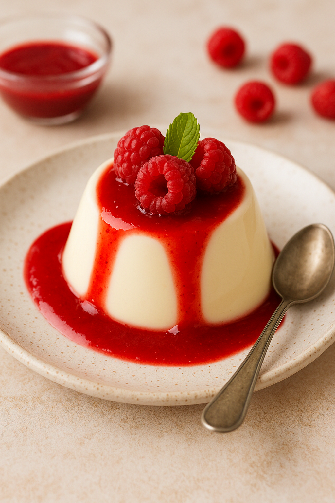

# Le Projet Panna Cotta
Ceci est mon premier projet, fait lors de mes debuts de formation Frontend, utilisation de HTML et CSS uniquement
## Pourquoi ?

Je trouvais ça interessant d'essayer de mettre en page ma recette de panna cotta. 

### lien vers les differents Document :

[Le document html](./projetpannacotta/html/index.html)

[Le document style](./projetpannacotta/css/style.css)

[Le document reset](./projetpannacotta/css/reset.css)

### Le backend

je Viens de finir le block backend de ma formation... pourquoi ne pas tenter d'ajouter un peu de backend ? let's go !

